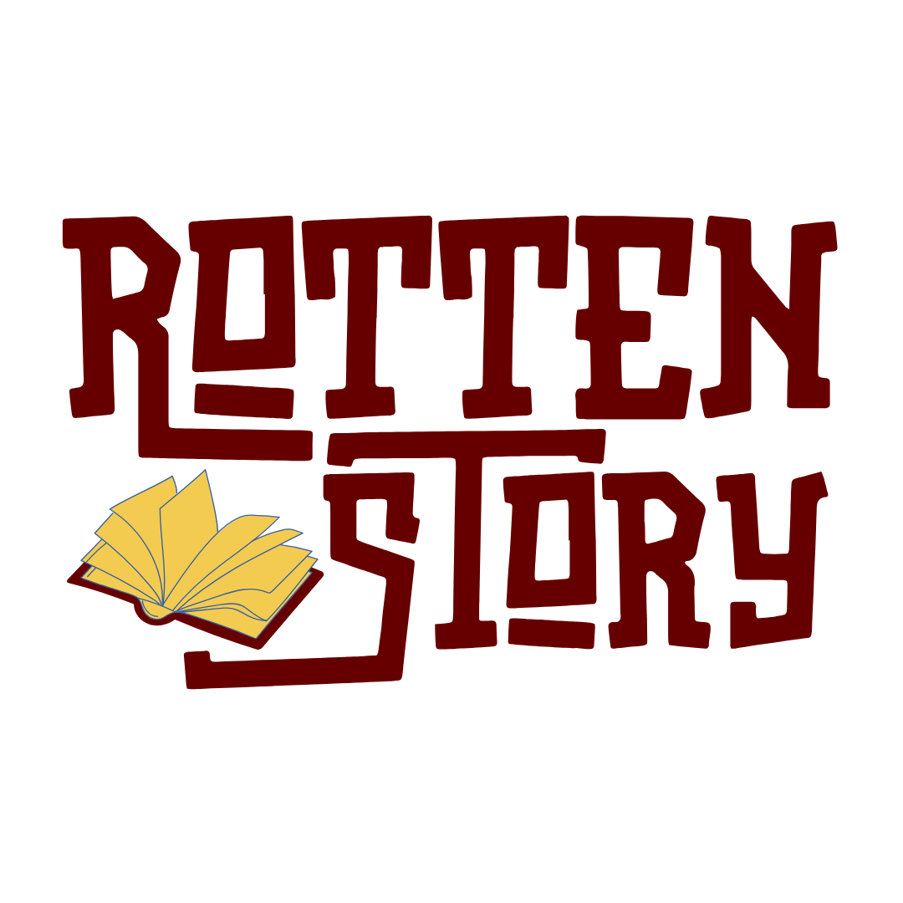
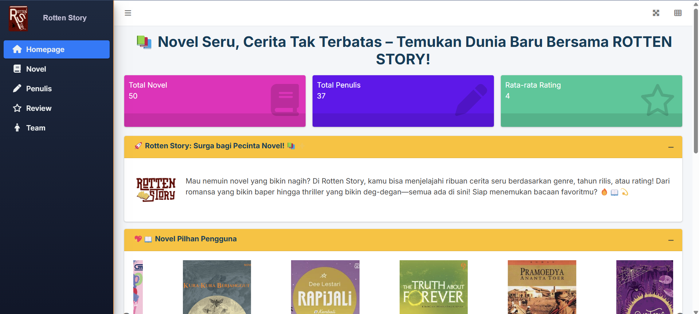
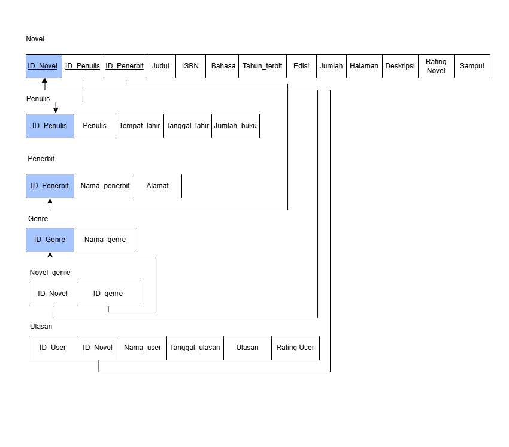
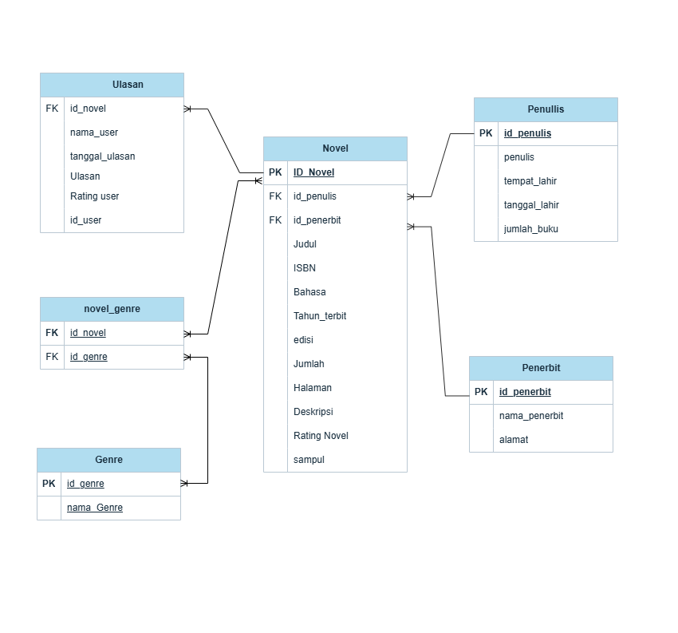

  

# Rotten Story

[Tentang](#scroll-tentang)
•
[Screenshot](#rice_scene-screenshot)
•
[Dokumentasi](#blue_book-dokumentasi)
  

## :bookmark_tabs: Menu
- [Tentang](#scroll-tentang) 📖
- [Screenshot](#rice_scene-screenshot) 📸
- [Skema Database](#floppy_disk-skema-database) 💾
- [ERD](#rotating_light-erd) 📈
- [Deskripsi Data](#heavy_check_mark-deskripsi-data) 📋
- [Struktur Folder](#open_file_folder-struktur-folder) 📁
- [Tim Pengembang](#smiley_cat-tim-pengembang) 👨‍💻

## 📔 Tentang

  
🎭 **Rotten Story – Surga Pecinta Novel!** 📖✨

Bosan dengan rekomendasi novel yang itu-itu saja? Rotten Story hadir buat kamu yang ingin menemukan bacaan terbaik berdasarkan rating dan ulasan komunitas pembaca! Dari romansa yang bikin baper, thriller yang bikin merinding, hingga petualangan epik yang bikin betah berjam-jam—semua ada di sini!

💡 Kenapa Harus Rotten Story?

✅ Rekomendasi Akurat – Cari novel berdasarkan rating tinggi, genre favorit, atau tahun terbit!

✅ Review Jujur – Lihat ulasan dari pembaca lain sebelum memilih novel terbaik.

✅ Filter Pintar – Pilih novel yang sesuai dengan selera kamu dengan sistem pencarian yang fleksibel.

✅ Data Lengkap – Dari jumlah halaman, tahun terbit, hingga ISBN, semua informasi ada di Rotten Story!

✅ Tampilan Interaktif – Nikmati pengalaman eksplorasi novel yang lebih menyenangkan dengan grafik dan slider interaktif.

🌟 Rotten Story Buat Siapa?

📖 Kamu yang suka membaca – Dapatkan rekomendasi novel yang sesuai selera.

✍️ Kamu yang suka menulis review – Bantu pembaca lain menemukan novel terbaik!

📊 Kamu yang suka analisis data – Eksplorasi tren novel dari berbagai genre dan tahun terbit.

Jangan cuma baca, jadilah bagian dari komunitas Rotten Story! Eksplor, ulas, dan temukan novel terbaikmu sekarang! 🚀📚

## 👀 Screenshot

  

## ⛓️ Skema Database

**Struktur Primary Key dan Foreign Key** digunakan untuk membangun hubungan antara tabel **Novel, Penulis, Penerbit, Genre,** dan **Ulasan** dalam database **Rotten Story**. Relasi ini memastikan keterkaitan antar entitas sehingga data dapat terorganisir dengan baik dan mendukung sistem dalam mengelola informasi novel serta interaksi pengguna secara optimal.

  

## 🗃️ ERD

Entity-Relationship Diagram (ERD) adalah representasi visual dari struktur 
sebuah database yang menggambarkan hubungan antara entitas (tabel) dalam sistem., 
Penulis memiliki atribut id_Penulis, yang berhubungan dengan entitas Novel.

Selanjutnya, Novel memiliki atribut id_novel, yang terhubung dengan
dua entitas lainnya, yaitu ulasan dan novel_genre.

Novel juga memiliki hubungan dengan penerbit dan genre yang mana
melalui id_genre entitas genre dn novel dapat terhubung, dan id-penerbit menghubungkan 
entitas novel dan penerbit

  

## 📮 Deskripsi Data

Rotten Story memiliki beberapa dataset utama yang digunakan untuk mengelola informasi novel dan interaksi pengguna. Berikut adalah deskripsi masing-masing dataset:

### 📚 Tabel Novel

Tabel Novel menyediakan informasi berupa daftar novel yang membantu pengguna baik untuk memberikan ulasan maupun mencari referensi bahan bacaan. Informasi pada tabel Novel ini mencakuo id_novel, id_penulis, id_penerbit, judul, sampul, ISBN, bahasa, tahun_terbit, dsb. dengan detail berupa:

| Attribute    | Type                   | Description   |
|:-------------|:-----------------------|:--------------|
| id_novel     |      varchar(20)       | Id novel      |
| id_penulis   |      varchar(20)       | id penulis    |
| id_penerbit  |      varchar(20)       | id penerbit   |
| judul        |        text            | judul         |
| ISBN         |        text            | isbn          |
| tehun_terbit |       bignint          | tahun terbit  |
| rating_novel |       double           | rating novel  |

### 🗣️ Tabel ulasan

Tabel ulasan berisi informasi yang membantu pengguna dalam menentukan kualitas sebuah buku berdasarkan ulasan pengguna lainnya. Informasi dalam tabel ini mencakup **id_novel, nama_user, tanggal_ulasan, ulasan, rating user,** dan **id_user**, yang dapat digunakan untuk memberikan rekomendasi novel berdasarkan ulasan pengguna lain.

Berikut adalah deskripsi dari setiap atribut dalam tabel ulasan:

| Attribute  | Type                   | Description            |
|:-----------|:-----------------------|:-----------------------|
| id_user    |          text          | id user                |
| Ulasan     |          text          | Ulasan                 |
| Rating_user|         bigint         | Rating user            |

### 🔥tabel novel_genre
Tabel Prodi menyediakan informasi mengenai genre dari novel tersebut. informasi pada tabel ini mencakup id_novel, dan id_genre 

| Attribute        | Type                   | Description        |
|:-----------------|:-----------------------|:-------------------|
| id_novel         |      varchar(20)       |      Id novel      |
| id_genre         |      varchar(20)       |      Id genre      |

###  👻tabel genre

Tabel genre menyediakan informasi genre-genre yang tersedia, yang terdiri dari 12 genre. Tabel ini tersusun dari id_genre, dan nama genre

| Attribute        | Type                   | Description    |
|:-----------------|:-----------------------|:---------------|
| id_genre         |     varychar(20)       | id genre       |
| nama genre       |          text          | nama genre     |

###  ✍️tabel penulis

Tabel penulis menyediakan informasi tentang penulis buku tiap novel. informasi ini menyediakan id_penulis, penulis, tempat_lahir, tanggal lahir, dan jumlah_buku

| Attribute        | Type                   | Description    |
|:-----------------|:-----------------------|:---------------|
| id_penulis       |       varchar(20)      | id penulis     |
| jumlah_buku      |         bigint         | jumlah buku    |
| tempat_lahir     |          text          | tempat lahir   |
| tanggal_lahir    |          text          | tanggal lahir  |

###  🔖penerbit

Tabel penerbit menyediakan informasi tentang penerbit setiap buku yang tersedia. informasi ini menyediakan id_penerbit, nama_penerbit, alamat
| Attribute        | Type                   | Description      |
|:-----------------|:-----------------------|:-----------------|
| id penerbit      |     varchar(20)        | id penerbit      |
| nama_penerbit    |        text            | nama penerbit    |
| alamat           |        text            | alamat penerbit  |

## 🤓: Tim Pengembang 

-   🦦:Database Manager : [Jasmin Nur Hanifa
    ](https://github.com/heyitsjasmin) (M0501241060)
-   🐳:Frontend Developer : [Yeky Abil Nizar
    ](https://github.com/yekyabilnizar) (M0501241043)
-   🪑:Backend Developer : [A.Ahmad Qeis Tenridapi
    ](https://github.com/qeiz21) (M0501241068)
-   👼: Database Designer : [Windi Pangesti
    ](https://github.com/windipngsti) (M0501241022)
